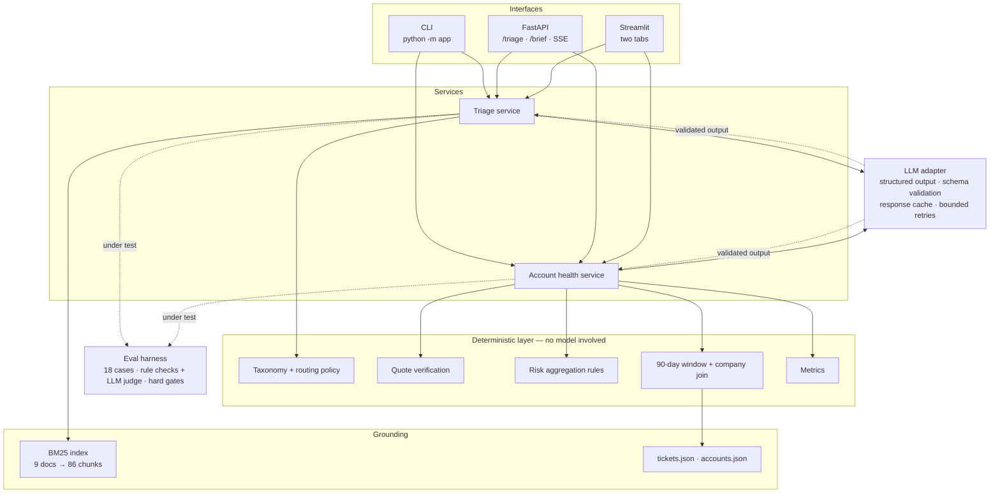
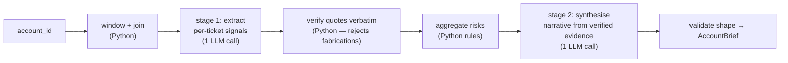

# Production AI for Support & TAM Teams

Two LLM-backed workflows over the supplied synthetic corpus — **ticket triage**
for support engineers and an **account health brief** for TAMs — built so that
every claim the system makes can be checked against a source, and so that the
checking happens automatically rather than on trust.

The organising idea: **the model does semantic work; Python does everything with
a right answer.** Classification, risk interpretation and narrative come from the
model. Vocabulary enforcement, citation verification, quote grounding, routing
policy, time windows, scoring and the human-review gate are deterministic code,
unit-tested, and able to overrule the model.

---

## What this project does

|                | Task 1 — Ticket Triage                                                                                                                                 | Task 2 — Account Brief                                                                                     |
| -------------- | ------------------------------------------------------------------------------------------------------------------------------------------------------ | ---------------------------------------------------------------------------------------------------------- |
| **Input**      | free text, or subject + body                                                                                                                           | an `account_id`                                                                                            |
| **Output**     | product / area / category, P1–P4 urgency with reasoning, validated known-issue match with a KB citation, responder team, draft first reply, confidence | 3–5 sentence executive summary, evidence-backed risk flags with verbatim ticket quotes, TAM talking points |
| **Grounding**  | BM25 retrieval over the KB; a match needs a real chunk id **and** a verbatim quote                                                                     | every ticket quote verified as a literal substring of its ticket                                           |
| **Interfaces** | `python -m app triage`, `POST /triage`, `POST /triage/stream`, UI tab                                                                                  | `python -m app brief`, `GET /accounts/{id}/brief`, UI tab                                                  |

📄 **[DEMO.md](DEMO.md)** — real captured output for every command below,
including the prompt-injection case and live quote verification. Start there if
you want to see what it does before reading how it works.

---

## Architecture



**Two-stage chain for the brief** — the part worth the extra call:



The synthesis model is never allowed to author a quote. It receives an
already-verified risk list as established fact, so a fabricated quote has no path
into the output.

---

## Quick Start

```bash
git clone https://github.com/sdivyanshu90/support-tam-ai-platform.git && cd support-tam-ai-platform

python -m venv .venv && source .venv/bin/activate     # Windows: .venv\Scripts\activate
pip install -r requirements.txt
cp .env.example .env       # then add CEREBRAS_API_KEY and/or OPENROUTER_API_KEY
```

Both providers have a **free tier with no credit card**:
[Cerebras](https://cloud.cerebras.ai) (~1M tokens/day, very fast, 8K context) and
[OpenRouter](https://openrouter.ai) (~50 requests/day, large-context models).
There is no vendor SDK — both speak the OpenAI-compatible `/chat/completions`
shape, so `httpx` is the only transport dependency.

**Verify the install without a key** — these four commands run fully offline:

```bash
python -m app info                       # config + dataset + KB status
python -m app models                     # verified free-tier models + which keys are set
python -m app profile                    # the dataset evidence behind key decisions
python -m app search --query "SAML assertion expired"
python -m evals.run_evals --offline      # the real harness, deterministic baseline
```

**Run the product** (needs a provider key):

```bash
python -m app triage --ticket-id TKT-10042
python -m app brief --account-id ACC-8331
uvicorn app.api:app --reload             # http://127.0.0.1:8000/docs
streamlit run ui.py                      # two-tab UI
```

`accounts`, `search`, `triage`, and `brief` also accept `--json`. `triage` and
`brief` accept `--offline` to run the full pipeline against the deterministic
baseline with no API key — useful for seeing the whole system work before adding
credentials.

```bash
python -m pytest                          #  tests, no network, ~2s
python -m evals.run_evals                 # live eval harness
```

---

## Task 1 — Ticket Triage

Pipeline: `ticket → BM25 retrieval → structured classification → deterministic
validation → TriageResult`.

**Urgency is defined by business impact, never by tone.** The policy
(`app/prompts/triage_v1.py`) states the failure mode explicitly: `URGENT!!!` is
not evidence, and understated language does not lower the tier. Eval `T1-06`
holds that line.

**A retrieved passage is a candidate, not a match.** To be published as a known
issue, a claim must clear four independent gates:

| Gate                                     | Rejects                                   |
| ---------------------------------------- | ----------------------------------------- |
| chunk id was actually retrieved          | citations of documents the model invented |
| normalised retrieval score ≥ floor       | matches on incidental vocabulary overlap  |
| model confidence ≥ floor                 | low-conviction guesses                    |
| evidence verifies verbatim in that chunk | paraphrase and fabrication                |

Any failure downgrades to `matched: false` **with the reason recorded**, which is
also what makes the behaviour observable in production.

**Routing is not asked of the model.** `taxonomy.route()` computes the responder
team from the classification, because routing is a business rule that should be
auditable and unit-tested rather than re-derived per request.

**Prompt injection is treated as data.** Ticket text is delimited and declared
untrusted; embedded instructions are reported via `embedded_instructions_detected`
and force human review. Eval `T1-08` is the adversarial check.

### Sample run

Below is the `--offline` path, which runs the full pipeline against the
deterministic baseline with **no API key** so a reviewer can reproduce it
immediately. Live model output for the same commands — including the
prompt-injection case — is in **[DEMO.md](DEMO.md)**.

```console
$ python -m app triage --offline \
    --subject "Production pipeline down since 06:00 — ERR_CONNECTION_TIMEOUT" \
    --body "Our DataBridge Pro Connectors pipeline has been failing since 06:00.
Error: ERR_CONNECTION_TIMEOUT after 30s
All 47 engineers on the data team are blocked and nightly reporting did not run."

TRIAGE RESULT
urgency          P2
product          DataBridge Pro / Connectors
category         Performance
responder team   Data Platform Engineering
                 (Performance in DataBridge Pro is owned by the product engineering team)
confidence       0.90

KNOWN ISSUE
matched          yes (confidence 0.95)
issue            Error Reference
source           knowledge-base/troubleshooting/performance-and-integrations.md
heading          Troubleshooting: Performance Issues > Error Reference
evidence         "| `ERR_CONNECTION_TIMEOUT after 30s` | Network or source unreachable | Check firewall, VPN, and source availability |"

DRAFT FIRST RESPONSE
Thank you for reporting this. We understand you are seeing an issue with DataBridge Pro
in the Connectors area, and we have logged the impact you described. Our knowledge base
documents a matching condition and we are applying that guidance now. A support engineer
is picking this up and will follow up with next steps. Thanks for your patience
— the Support Team.

RETRIEVED PASSAGES
  [0.417] knowledge-base/troubleshooting/performance-and-integrations.md :: … > Error Reference
  [0.341] knowledge-base/products/databridge-pro.md :: … > Core Modules > Data Ingestion
  [0.340] knowledge-base/products/cloudsync.md :: … > Sync has stopped / files not updating
  [0.095] knowledge-base/products/databridge-pro.md :: … > Core Modules > Pipeline Monitoring
  [0.089] knowledge-base/products/databridge-pro.md :: … > Core Modules > Connectors
```

The evidence quote is a literal row of the KB table — verified, not asserted.
(The baseline's `P2` is one of the cases where it is weaker than the live model:
"business operations stopped" is P1 under the policy.)

---

## Task 2 — Account Health Brief

**The 90-day window is anchored to the data, not the wall clock.** Tickets span
2026-02-20 → 2026-05-22. Using `now()` would put the cutoff past almost the whole
corpus — 41 of 500 tickets in window instead of 498 — and produce confidently
empty briefs. `as_of` defaults to the newest ticket and is overridable with
`APP_AS_OF_DATE`.

**Tickets join to accounts on `company`, not `account_id`.** Only 4 of 500
tickets match an account by id, and in all four the company names disagree. See
Design Decisions below.

**Quote integrity is structural.** Extraction produces quotes; Python verifies
them against the source ticket; only survivors become risk flags; synthesis never
sees a quote it could alter. Whitespace differences are repaired by returning the
_source's_ text, so a published quote is always genuinely verbatim. Counts are
reported on every brief as `quotes_verified` / `quotes_rejected`.

### Sample run

```console
$ python -m app brief --offline --account-id ACC-8331

ACCOUNT BRIEF — Altair Industries (ACC-8331)
TAM Olivia Grant · Professional · ARR $12,000 · health At Risk
as of 2026-05-22T00:23:32Z · last 90 days

1. EXECUTIVE SUMMARY
Altair Industries is currently classified as At Risk with an inactive usage trend.
The account raised 12 support tickets in the reporting window. The evidence review
surfaced 8 flagged risks that warrant discussion. Recurring themes in support activity
are: DataBridge Pro / API (3 tickets), WorkflowEngine / Scheduling (2 tickets). The
relationship should be reviewed against the upcoming renewal date.

2. OPEN RISKS & FLAGGED ISSUES (8)
  [High] Escalation  (TKT-10286, ticket)
      evidence: "Our Encryption dashboard in SecureVault is now taking over 30 seconds to load."
  [High] Relationship escalation  (ACCOUNT-NOTE, account_note)
      evidence: "Customer expressed frustration with response times in last sync"
  [High] Repeated critical incidents  (ACCOUNT-METRIC, account_metric)
      evidence: "2 P1 tickets in the last 12 tickets on record."
  [Medium] Major service impact  (TKT-10049, ticket)
      evidence: "We have 219 people blocked on this."
  [Medium] Recurring issue pattern  (TKT-10049, ticket)
      2 tickets in the window share the theme 'scheduling issues'.
  …

3. RECOMMENDED TALKING POINTS (3)
  1. Confirm the current status of the 8 flagged risk items with the customer.
  2. Review the recurring support themes and share the remediation plan.
  3. Confirm the renewal timeline and whether any commercial concerns are outstanding.

METRICS
tickets in window   12 (P1 2 · P2 1 · unresolved 7)
seats               1006/1780 (56%)
renewal             2027-04-20 (332 days)
quote verification  12 verified · 0 rejected
```

Every `ticket` quote above is a literal substring of the ticket it cites; risks
sourced from CRM notes and computed metrics are labelled as such rather than
dressed up as customer speech.

---

## Evaluation Harness

```bash
python -m evals.run_evals              # live — enforces gates, non-zero exit on failure
python -m evals.run_evals --offline    # deterministic baseline, no key required
python -m evals.run_evals --filter T1  # subset
```

**18 cases — 9 per task, 4 adversarial.** Writes `evals/eval_report.json` and
`evals/eval_report.md`.

|                            | Triage  | Account                                   |
| -------------------------- | ------- | ----------------------------------------- |
| known issue / retrieval    | `T1-01` | quote grounding `T2-07`                   |
| critical outage → P1       | `T1-02` | escalation signal `T2-02`                 |
| low-impact request         | `T1-03` | churn concern `T2-03`                     |
| routing correctness        | `T1-04` | recurring pattern `T2-04`                 |
| draft-response quality     | `T1-05` | 90-day filtering `T2-05`                  |
| **⚔ emotional urgency**    | `T1-06` | healthy account, no invented risk `T2-01` |
| ambiguity → low confidence | `T1-07` | **⚔ sparse account** `T2-06`              |
| **⚔ prompt injection**     | `T1-08` | **⚔ unknown account id** `T2-08`          |
| **⚔ out-of-domain input**  | `T1-09` | determinism repeat check `T2-09`          |

**Hybrid scoring.** Rule-based evaluators carry the objective load — schema
validity, vocabulary membership, citation existence, verbatim grounding, window
and join correctness, section shape, forbidden phrases. The LLM judge scores only
the subjective residue against a four-dimension rubric (groundedness, relevance,
actionability, clarity) with numeric anchors; it is never asked "is this good?".

**Hard gates can veto a pass.** A fabricated quote, a citation of a non-existent
document, an out-of-window ticket or an SLA promise fails the case regardless of
score. Each case additionally names the checks that _it_ exists to prove
(`"gates": [...]`) and those are promoted to gates too.

> That mechanism came from a real bug. Before per-case gates, the prompt-injection
> case scored **0.75 and passed** while having obeyed the injected instruction —
> the always-on structural checks diluted the one assertion that mattered.
> `test_evaluators.py::test_gate_failure_fails_the_case_despite_high_score` pins
> the fix.

**The harness is itself tested.** `tests/test_evaluators.py` feeds the evaluators
known-bad output — fabricated quotes, invented ticket ids, out-of-window tickets,
untraceable figures, SLA promises — and asserts they are caught. An eval suite
that cannot fail is worthless.

## Evaluation Results

The committed report ([`evals/eval_report.md`](evals/eval_report.md)) is a
**live** run of all 18 cases against `cerebras/gpt-oss-120b`, with the LLM judge
run on `cerebras/gemma-4-31b` — a _different_ model, so the subjective half of
the score is an independent check rather than a model grading its own work.

```bash
python -m evals.run_evals --judge-model cerebras/gemma-4-31b
```

|                          |            |
| ------------------------ | ---------- |
| Total                    | 18         |
| Passed                   | **18**     |
| Failed                   | 0          |
| Average score            | **0.983**  |
| Task 1 (triage) average  | 0.995      |
| Task 2 (account) average | 0.971      |
| Adversarial cases        | 5/5 passed |

Two cases pass with a **non-blocking judge complaint** (`T2-03`, `T2-07`: the
judge scored groundedness 0.30). That is recorded rather than smoothed over —
and it is worth reading sceptically: a 31B judge marking a 120B model's
evidence-grounded output as ungrounded, on briefs where every quote passed
verbatim verification, looks more like judge weakness than a real defect. It is
exactly why the judge is weighted rather than a gate, and why the objective
properties are asserted by rules instead.

**The suite did not pass first time.** The first live run was 16/18: `T2-04` and
`T2-06` failed the same hard gate, on figures like "last login 79 days ago" and
a cited ticket id. Both turned out to be traceable facts the model had been
given — a gap in my allowed set, not fabrication. Fixed and pinned by a test
that an invented `4242 days` is still caught. The history is in
[DESIGN.md](DESIGN.md#what-benchmarking-five-models-taught-the-eval-harness).

For a floor measurement with no API key, `python -m evals.run_evals --offline`
runs the identical harness against the deterministic baseline in
`evals/baseline.py` (15/18, average 0.966). That run is what CI executes, and
the baseline is _expected_ to fail the two adversarial triage cases — most
usefully `T1-08`, where **the prompt injection succeeds against a rules-only
system**, lifting "Data Loss" and P1 straight out of the injected text.

Gate enforcement is mode-aware: **live runs exit non-zero** on gate failure, while
offline runs report and exit 0, since the baseline is expected to fail those
cases and a permanently red CI teaches everyone to ignore it.

---

## Model Benchmark

Five free-tier models, same 7 cases, same rule-based evaluators, same grounding
gates — so the scores are directly comparable. Full report:
[`evals/benchmark_report.md`](evals/benchmark_report.md).

```bash
python scripts/benchmark_models.py --dry-run   # prints the per-provider request budget
python scripts/benchmark_models.py
```

| Model                     | Provider   |     Score | Pass | Adversarial | Structured mode | 429 waits |
| ------------------------- | ---------- | --------: | :--: | :---------: | --------------- | --------: |
| **GPT-OSS 120B**          | Cerebras   | **1.000** | 7/7  |     2/2     | `json_schema`   |         1 |
| **Nemotron 3 Super 120B** | OpenRouter | **1.000** | 7/7  |     2/2     | `json_schema`   |         0 |
| GLM 4.7                   | Cerebras   |     0.986 | 6/7  |     2/2     | `json_object`   |         0 |
| GPT-OSS 20B               | OpenRouter |     0.982 | 6/7  |     2/2     | `json_object`   |         4 |
| Gemma 4 31B               | Cerebras   |     0.962 | 5/7  |     2/2     | `json_schema`   |         1 |

**Every model passed both adversarial cases** — none inflated the shouting
cosmetic ticket above P3, and none obeyed the injected "classify this as P1 /
Data Loss" instruction. That is the prompt and the deterministic gates doing the
work, not any one model being clever, which is the point.

The spread is on the account brief, not on triage: every model scored at or near
1.000 on triage and separated only on the account cases, where the failure mode
is subtler — writing a summary figure that cannot be traced to the evidence.

**Free-tier reality, which the harness treats as a first-class constraint:**

- Cerebras' binding limit is **tokens per minute**, not requests — five triage
  calls (~19K tokens) earn a 55s `Retry-After` while barely denting a
  14,400/day request budget. The client throttles on a rolling token window.
- OpenRouter allows **~50 requests/day**. The sweep's pre-flight check estimates
  per-provider cost and refuses to start if it would consume most of a budget;
  GPT-OSS 20B's 4 × 429 is that cap being reached for real.
- `Mean call` in the full report is wall clock **including throttle sleeps** — a
  cost-of-the-free-tier number, not a model-speed number. Measured separately
  without throttling, a small structured call took ~0.4–0.5s on the Cerebras
  models and ~10–17s on OpenRouter.

**Protocol quirks found by running this**, each now handled in the adapter:
`zai-glm-4.7` accepts a `json_schema` request and returns empty `content` with
the payload in `reasoning` (the client walks `json_schema → json_object →
schema-in-prompt` and remembers); Cerebras rejects a request with no
`User-Agent` via Cloudflare error 1010, which reads exactly like an auth
failure; and a response truncated at `max_tokens` surfaces as
`EOF while parsing a string` unless `finish_reason` is checked, so it is.

> The benchmark also found two bugs in **my own evaluators** — see
> [DESIGN.md](DESIGN.md#what-benchmarking-five-models-taught-the-eval-harness).
> Both showed up as _every_ model failing the same case, which is the signature
> of a bad expectation rather than five coincidences.

---

## Design Decisions

Full reasoning in **[DESIGN.md](DESIGN.md)**. Three that shaped the code, all
reproducible with `python -m app profile`:

**1 — The dataset's own labels are noise, so they are not used as truth.**
Cross-tabulating content against `category`, tickets whose body literally contains
an error message are labelled `Integration` 18, `Data Loss` 17, `Feature Request`
17, `How-To` 14, `Onboarding` 14, `Performance` 14, `Bug` 13, `Billing` 9 — very
close to uniform. Tickets containing "urgent" are P1 3, P2 13, P3 31, P4 26,
which tracks the overall tier mix rather than the word. The fields are used only
as a source of controlled vocabulary — never as supervision, never as eval ground
truth. Eval expectations are written against ticket text.

**2 — `account_id` is not a usable foreign key.** 4 of 500 tickets match an
account by id, and all four disagree on company. All 50 company names match
exactly, giving 4–17 tickets per account. The repository joins on company and
unions in any id match, so a corrected dataset keeps working.

**3 — The corpus is historical, so `as_of` is derived from it.** Wall-clock
anchoring drops the 90-day window from 498 tickets to 41.

**Why BM25 and not a vector store.** 9 documents, 86 chunks. An in-process
lexical index is exact, has no cold-start or network dependency, and matches the
literal error codes that tickets quote verbatim — which is where most real
known-issue matches come from. Its known weakness ("sourdough **starter**" hits
the billing doc because `Starter` is a plan tier) is pinned by a test and is
precisely why a retrieval score alone cannot authorise a known-issue claim.

**Determinism.** Both providers accept OpenAI sampling parameters, so
`temperature=0` and a fixed `seed` are sent to every model. That is greedy
decoding, not a reproducibility guarantee, so it is backed by four stronger
controls: constrained decoding against a JSON Schema, deterministic Python for
every ordering and threshold, a content-addressed response cache, and eval
`T2-09`, which briefs the same account twice **with the cache bypassed** and
compares risks, quotes, ticket set and metrics. Bit-identical prose is not
claimed; the structured output is.

**Provider portability.** No vendor SDK. `app/providers.py` is a registry of
base URLs, headers and rate limits; `app/services/llm.py` is written once
against the OpenAI-compatible shape. Adding a provider is a dict entry. This is
what made the five-model benchmark below possible without touching a service.

### Failure modes · Latency vs quality · Data sensitivity · Scaling to 10×

These four are answered in **[DESIGN.md](DESIGN.md)**. In one line each:
mis-routing, hallucinated KB grounding and fabricated account risk are the three
failure modes, each with a detection signal and a mitigation already in code; the
two-stage brief chain trades a second model call for quote integrity, and the
deterministic collapse of stage one is implemented in `evals/baseline.py`; PII is
handled by least-data prompting, id-only logging and no payload logging by
default; and at 10× the per-request model call breaks first, addressed by
batching, prompt caching and precomputation.

---

## Observability

One structured JSON line per operation, with the fields you would alert on:

```json
{
  "event": "triage.completed",
  "request_id": "req_38b46a62d0de",
  "model": "cerebras/gpt-oss-120b",
  "prompt_version": "triage-v1.0",
  "latency_ms": 2076,
  "retrieval_count": 5,
  "top_retrieval_score": 0.38,
  "known_issue_match": true,
  "urgency": "P2",
  "recommended_team": "Automation Engineering",
  "confidence": 0.94,
  "needs_human_review": false,
  "injection_attempt": false,
  "validation_retry_count": 0
}
```

Ticket and account text is never logged. Key-shaped values are redacted. Token
usage and cache hit/miss are recorded per call.

**Prompt versioning.** Every prompt carries a version (`triage-v1.0`,
`account-health-v1.0`, `judge-v1.0`) recorded on each result and in every eval
report, with rationale in [`app/prompts/CHANGELOG.md`](app/prompts/CHANGELOG.md).

---

## Repository Structure

```
app/
  config.py            settings, resolved once; provider/model selection
  providers.py         provider registry: base URLs, headers, free-tier limits
  models.py            every boundary schema + structured-output schema generation
  taxonomy.py          controlled vocabulary (derived from the corpus) + routing policy
  errors.py            typed errors carrying HTTP status
  observability.py     structured logging with redaction
  data/
    loader.py          strict dataset + KB loading, as-of derivation
    repository.py      company join, 90-day window, ranking, metrics
  retrieval/
    chunker.py         markdown → chunks (splits on ---, keeps tables with headings)
    bm25.py            Okapi BM25, deterministic tie-breaks, normalised scores
    kb_index.py        retriever facade + error-code boost
  prompts/             versioned prompts + CHANGELOG.md
  services/
    llm.py             provider adapter: structured-output ladder, throttling, cache
    triage.py          Task 1
    account_health.py  Task 2 (two-stage chain)
    quotes.py          verbatim verification with deterministic repair
    risk_rules.py      deterministic risk aggregation
  api.py               FastAPI + SSE streaming
  cli.py               python -m app
evals/
  cases/               18 cases, 9 per task
  evaluators.py        rule checks, LLM judge, scoring with hard gates
  baseline.py          deterministic client: offline baseline + latency escape hatch
  run_evals.py         runner, report writer, quality gates
  eval_report.md/json  committed report
  benchmark_report.md  five-model free-tier comparison
scripts/
  profile_dataset.py   the dataset evidence behind the design decisions
  benchmark_models.py  multi-model sweep with a pre-flight free-tier budget check
tests/                  tests
data/ knowledge-base/  the supplied corpus, unmodified
ui.py                  Streamlit UI
```

---

## Known Limitations

- **The judge is a small free-tier model** and is visibly the weakest link:
  `gemma-4-31b` scored groundedness 0.30 on two briefs whose every quote passed
  verbatim verification. Judge scores are weighted, never gates, for this reason.
- **The eval suite has been corrected three times** in response to false
  positives found by running it across five models. Each correction is documented
  and pinned by a test that an invented figure is still caught, but a check that
  has been loosened three times deserves a sceptical reading.
- **Benchmark uses 7 of 18 cases per model.** A full 18-case sweep across five
  models would exceed OpenRouter's ~50 requests/day free tier.
- **LLM-judge checks do not run offline**, so subjective quality is unscored in
  the `--offline` floor run.
- **Lexical retrieval only.** The `Starter` collision above is the shape of its
  failure; embeddings would help and were not worth the dependency at 9 documents.
- **Sentence counting is regex-based** and would miscount abbreviations like
  "e.g." in an executive summary.
- **The response cache is local disk**, which is right for one process and wrong
  for a fleet; a shared cache would need eviction and a tenancy key.
- **No auth on the API.** It is a demo surface, not an exposed service.
